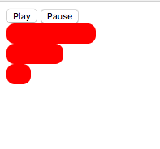

# dynamicProgressBars

Click Play to create new progress Bar
Click multiple times to create many progress bars
The goal is to pause all the progress bars 
Clicking Pause button should pause all the progress bars
